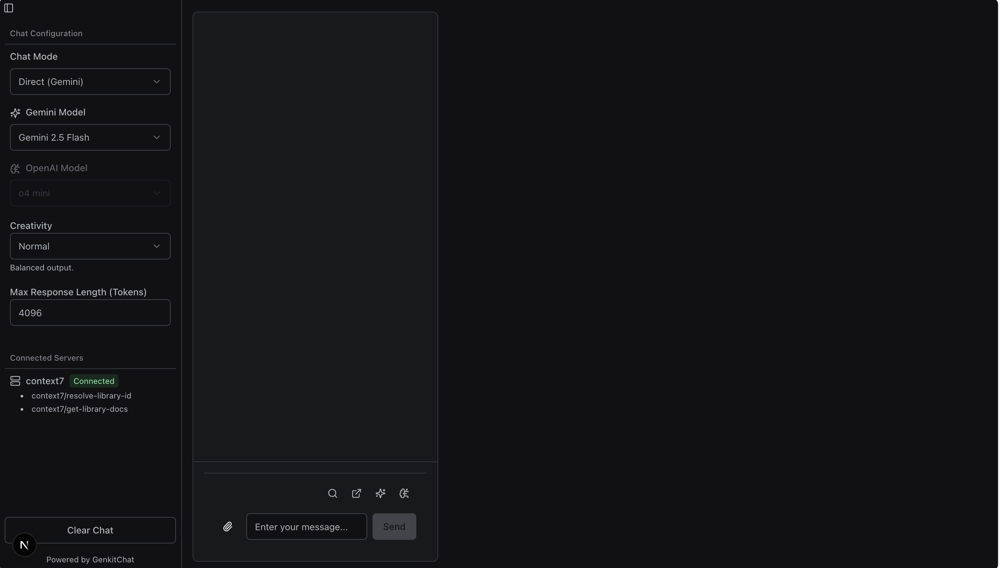

# Genkit Multi-LLM Chat Studio



This project is a web-based chat interface built with Next.js and powered by Google's Genkit framework. It serves as a demonstration and development environment for interacting with various Large Language Models (LLMs) through different configurations, including direct chat, Retrieval-Augmented Generation (Two-Step with Reranking), and integration with external tools via the Model Context Protocol (MCP).

## Features

* **Multi-LLM Support:** Connects to and utilizes models from:
  * Google AI (Gemini family) via `@genkit-ai/googleai`
  * OpenAI (GPT-4.1, GPT-4.1 Mini, etc.) via `genkitx-openai`
* **Multiple Chat Modes:**
  * **Direct Chat:** Interact directly with selected Gemini or OpenAI models.
  * **RAG Chat:** Upload PDF documents and query their content using Retrieval-Augmented Generation. Features two-stage retrieval with Google reranking model.
* **PDF Processing & Rendering:**
  * Uses `@papra/lecture` on the backend to extract text from uploaded documents (PDF, DOCX, etc.).
  * Client-side PDF rendering for citation previews using `react-pdf`.
* **Citation Preview:** When a citation is clicked in a RAG response, a sidebar opens to display the relevant page of the source PDF with the cited text highlighted.
* **DotPrompt Management:** System prompts are managed using Genkit's DotPrompt format (`.prompt` files) located in `src/ai/prompts/`, allowing for easier iteration and versioning of prompts.
* **Genkit Framework:** Core logic managed by Genkit flows defined in `src/lib/genkit-instance.ts`. This includes configuration for DotPrompt loading.
* **Model Context Protocol (MCP) Integration:**
  * Uses `genkitx-mcp` plugin to connect to external MCP servers.
  * To add an MCP Server:
        1. Install necessary Genkit MCP plugin(s) (e.g., `npm install genkitx-mcp`).
        2. In `src/lib/genkit-instance.ts`, import `mcpClient` from `genkitx-mcp`.
        3. Configure a new `mcpClient` instance with a unique `name` and the `serverProcess` details (command and args) for your desired MCP server.
        4. Add the configured client instance to the `plugins` array within the `genkit({...})` call.
  * Tools exposed by connected MCP servers are made available to LLMs (when specified in the `tools` array during generation/prompt definition).
  * The UI displays connected server status (based on configuration) and lists available tools.
* **Streaming Responses:** LLM responses are streamed token-by-token to the UI for a fluid user experience.
* **Markdown & Mermaid Rendering:** Chat responses are rendered as Markdown, including support for GitHub Flavored Markdown (GFM) and Mermaid diagram rendering.
* **Tool Call Visualization:** When an LLM uses a tool (like Context7), the tool name, input payload, and output payload are displayed beneath the message.
* **Configurable Parameters:** Adjust model behavior via UI controls:
  * **Creativity:** Select presets ('Precise', 'Normal', 'Creative') which adjust temperature and system prompts.
  * **Max Response Length:** Set the maximum token limit for responses.
* **Conversation Memory:** Basic chat modes maintain conversation history using Genkit's session management (currently in-memory). A "Clear Chat" button resets the session.
* **Modern UI:** Built with Next.js App Router, React, TypeScript, Tailwind CSS, and shadcn/ui components.

## Tech Stack

* **Framework:** Next.js (App Router)
* **Language:** TypeScript
* **AI Framework:** Genkit (`genkit`, `genkit/beta`)
  * Google AI Plugin: `@genkit-ai/googleai`
  * OpenAI Plugin: `genkitx-openai`
  * MCP Plugin: `genkitx-mcp`
  * Express/Next.js Handler Plugin: `@genkit-ai/express` (Provides API route handlers)
* **UI:** React, Tailwind CSS, shadcn/ui
* **Markdown/Diagrams:** `react-markdown`, `remark-gfm`, `rehype-highlight`, `mermaid`
* **PDF Handling:** `@papra/lecture` (backend text extraction), `react-pdf` & `pdfjs-dist` (client-side rendering)

## Getting Started

### Prerequisites

* Node.js (v18 or later recommended)
* npm or yarn
* API Keys:
  * Google AI (Gemini) API Key
  * OpenAI API Key

### Installation

1. Clone the repository:

    ```bash
    git clone <repository-url>
    cd <repo>
    ```

2. Install dependencies:

    ```bash
    npm install
    # or
    # yarn install
    ```

### Environment Variables

**You must create this file yourself.** Create a file named `.env.local` in the project root directory. Genkit requires API keys for the LLM providers you want to use. Add your keys to this file:

```dotenv
# .env.local

# Required for Google AI / Gemini Plugin
# Choose one:
GOOGLE_API_KEY=your_google_api_key_here
# or
GEMINI_API_KEY=your_gemini_api_key_here

# Required for OpenAI Plugin
OPENAI_API_KEY=your_openai_api_key_here

# Required for Tavily Search and Extract Tools
TAVILY_API_KEY=your_tavily_api_key_here

# Required for Perplexity Search and Deep Research Tools
PERPLEXITY_API_KEY=your_perplexity_api_key_here
```

**Important:** Never commit your `.env.local` file to version control. `.env` files are in `.gitignore` by default.

### Running the Application

This project integrates Genkit initialization directly within the Next.js server process. You **do not** need to run `genkit start` separately.

1. Start the Next.js development server:

    ```bash
    npm run dev
    ```

2. Open your browser to `http://localhost:9002` (or the specified port).

The application will start, initialize Genkit, load plugins (including starting the Context7 MCP server process via `npx`), and the UI should be ready.

## Usage

1. **Select Chat Mode:** Choose between "RAG", "Direct (Gemini)", or "Direct (OpenAI)".
2. **Configure Models:** Select the desired LLM (Gemini, OpenAI) and RAG endpoint (if applicable).
3. **Adjust Parameters:** Set the "Creativity" preset and "Max Response Length".
4. **Chat:** Type your message in the input box and press Enter or click "Send".
5. **Observe:**
    * Responses will stream into the chat window.
    * Markdown formatting (including code blocks and Mermaid diagrams) will be rendered.
    * If the LLM uses a tool (e.g., Context7), details will appear below the message.
    * The "Connected Servers" section shows the status of the Context7 MCP connection and its available tools.
6. **Clear Chat:** Use the "Clear Chat" button in the sidebar to start a new conversation and reset the session memory.

## Project Structure

* `src/app/`: Next.js App Router pages and API routes.
  * `page.tsx`: The main chat UI component, handles file uploads and citation sidebar logic.
  * `api/basic-chat/route.ts`: API endpoint for direct Gemini/OpenAI chat (streaming).
  * `api/rag-chat/route.ts`: API endpoint handling both file uploads (for indexing via `@papra/lecture`) and RAG queries (streaming).
  * `api/tools/route.ts`: API endpoint to list available tools.
* `src/lib/genkit-instance.ts`: Central location for Genkit initialization, plugin configuration, and flow definitions.
* `src/components/`: Reusable React UI components.
  * `CitationPreviewSidebar.tsx`: Component for displaying PDF source previews.
  * `PdfWorkerSetup.tsx`: Dynamically loaded component to configure the `react-pdf` worker.
* `src/services/rag.ts`: Contains the core RAG logic, including text extraction via `@papra/lecture`, chunking, and indexing.
* `src/ai/prompts/`: Contains `.prompt` files that define system prompts for various chat functionalities.
* `src/ai/available-models.ts`: Static definitions of models available in the UI selectors.

## Notes & Future Work

* **Tool Listing:** The `/api/tools` endpoint currently returns a hardcoded list for Context7 because dynamically listing tools registered via MCP client plugins proved difficult without relying on the `genkit start` Reflection API.
* **Session Storage:** Conversation history currently uses Genkit's default in-memory store. For production or multi-user scenarios, a persistent store (like Firestore via `@genkit-ai/firebase`) should be configured.
* **Error Handling:** Error handling in API routes and frontend fetch calls is basic and could be enhanced.
