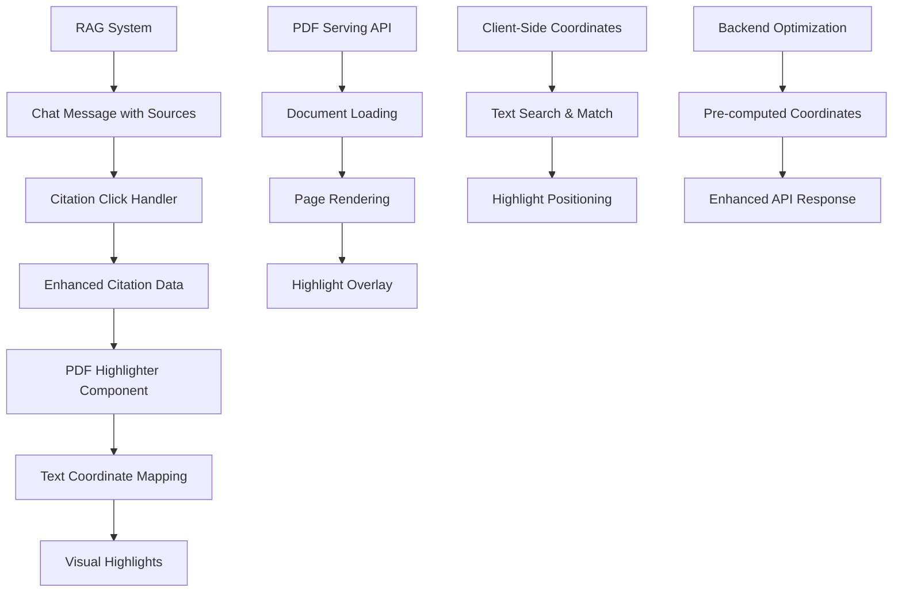

# PDF Citation Highlighting Implementation Plan

## Executive Summary

### Overview

This document outlines the implementation plan for adding granular citation chunk highlighting to the existing PDF citation system. The feature will enable users to see precise text highlights within PDF documents when viewing citations, significantly improving the user experience and citation accuracy.

### Business Value

- **Enhanced User Experience**: Users can quickly locate and verify cited content within PDF documents
- **Improved Citation Accuracy**: Visual highlighting reduces ambiguity about which specific text was referenced
- **Research Efficiency**: Faster navigation to relevant content sections within large documents
- **Trust and Transparency**: Clear visual connection between AI responses and source material

### Technical Feasibility

The implementation is highly feasible given the existing infrastructure:

- **Dependencies Available**: `react-pdf-highlighter` (8.0.0-rc.0) already installed
- **Data Structure Ready**: `CitationPreviewData.textToHighlight` field exists but unused
- **Robust Foundation**: Existing PDF serving API and citation flow work reliably
- **TypeScript Support**: Strong type definitions facilitate safe refactoring

## Current State Analysis

### Existing Capabilities

- **PDF Viewing**: Full PDF display using `react-pdf` library
- **Citation Metadata**: Rich citation data including `textToHighlight` field
- **File Serving**: Robust API with comprehensive error handling at `/api/files/[docIdParam]/route.ts`
- **Citation Flow**: Working RAG system → chat messages → sidebar integration
- **UI Framework**: Complete citation sidebar with responsive design

### Technical Infrastructure

- **Frontend**: Next.js 15.3.2 with React 18.3.1
- **PDF Libraries**: `react-pdf` 9.2.1, `react-pdf-highlighter` 8.0.0-rc.0
- **Styling**: Tailwind CSS with custom UI components
- **TypeScript**: Full type safety with well-defined interfaces

### Current Limitations

- **No Highlighting**: `textToHighlight` data not used for visual highlighting
- **No Coordinate Mapping**: No system to map text to PDF coordinates
- **Static Scaling**: Fixed 1.0 scale factor limits responsive design
- **Missing Integration**: `react-pdf-highlighter` installed but not integrated

## Proposed Solution Architecture

### High-Level Architecture



### Key Components

1. **Enhanced Citation Data Structures**
2. **PDF Highlighter Integration**
3. **Text Coordinate Mapping System**
4. **Highlight Rendering Engine**
5. **Performance Optimization Layer**

### Data Flow

1. User clicks citation → Enhanced `CitationPreviewData` loaded
2. PDF document loaded with `react-pdf`
3. Text coordinates calculated (client-side initially, server-side optimization later)
4. Highlights rendered using `react-pdf-highlighter`
5. User sees highlighted text within PDF context

## Detailed Implementation Plan

### Phase 1: Client-Side Highlighting Foundation (Weeks 1-3)

#### 1.1 Enhanced Data Structures

**Timeline**: 2 days
**Files Modified**: `src/types/chat.ts`

```typescript
// Enhanced coordinate system
interface HighlightCoordinates {
  pageNumber: number;
  rects: PdfRect[];
  textContent: string;
  confidence: number; // 0-1 scale for text matching accuracy
}

interface PdfRect {
  x: number;
  y: number;
  width: number;
  height: number;
}

// Enhanced CitationPreviewData
interface CitationPreviewData {
  fileName: string;
  content?: string;
  pdfUrl: string;
  pageNumber: number;
  textToHighlight: string;
  documentId: string;
  chunkId: number;
  
  // New highlighting fields
  highlightCoordinates?: HighlightCoordinates[];
  highlightColor?: string;
  highlightOpacity?: number;
}
```

**Tasks**:

- [ ] Add `HighlightCoordinates` and `PdfRect` interfaces
- [ ] Extend `CitationPreviewData` with highlighting fields
- [ ] Add fallback strategies for coordinate calculation
- [ ] Update type exports and imports

#### 1.2 PDF Highlighter Integration

**Timeline**: 5 days
**Files Modified**: `src/components/CitationPreviewSidebar.tsx`

```typescript
// Import react-pdf-highlighter
import {
  PdfLoader,
  PdfHighlighter,
  Highlight,
  Popup,
  AreaHighlight,
} from "react-pdf-highlighter";

// Integration component
const EnhancedPdfViewer: React.FC<{
  pdfUrl: string;
  highlights: HighlightCoordinates[];
  onHighlightClick?: (highlight: HighlightCoordinates) => void;
}> = ({ pdfUrl, highlights, onHighlightClick }) => {
  // Implementation details
};
```

**Tasks**:

- [ ] Replace basic `Document`/`Page` with `PdfHighlighter`
- [ ] Implement highlight rendering from `HighlightCoordinates`
- [ ] Add highlight interaction handlers
- [ ] Preserve existing PDF loading/error states
- [ ] Maintain responsive design and styling

#### 1.3 Client-Side Text Coordinate Calculation

**Timeline**: 6 days
**Files Created**: `src/utils/pdfTextMapper.ts`

```typescript
interface TextSearchResult {
  pageNumber: number;
  coordinates: PdfRect[];
  confidence: number;
  matchedText: string;
}

class PdfTextMapper {
  async findTextCoordinates(
    pdfDocument: PDFDocumentProxy,
    searchText: string,
    pageNumber?: number
  ): Promise<TextSearchResult[]> {
    // Implementation with fallback strategies
  }
  
  private async searchInPage(
    page: PDFPageProxy,
    searchText: string
  ): Promise<PdfRect[]> {
    // Page-specific text search
  }
}
```

**Tasks**:

- [ ] Create `PdfTextMapper` utility class
- [ ] Implement fuzzy text matching algorithms
- [ ] Add multiple search strategies (exact, partial, fuzzy)
- [ ] Handle text normalization and special characters
- [ ] Add performance monitoring and logging

#### 1.4 Basic Highlighting Functionality

**Timeline**: 3 days
**Files Modified**: `src/components/CitationPreviewSidebar.tsx`

**Tasks**:

- [ ] Integrate `PdfTextMapper` with `CitationPreviewSidebar`
- [ ] Add loading states for coordinate calculation
- [ ] Implement fallback to page-only display if highlighting fails
- [ ] Add basic error handling and user feedback
- [ ] Create highlight styling consistent with app theme

**Deliverables**:

- Working text highlighting in PDF viewer
- Fallback mechanisms for failed highlighting
- Basic performance metrics and logging
- Unit tests for core functionality

### Phase 2: Backend Optimization & Advanced Features (Weeks 4-7)

#### 2.1 Enhanced File Serving API

**Timeline**: 4 days
**Files Modified**: `src/app/api/files/[docIdParam]/route.ts`

```typescript
// Enhanced API response with coordinate data
interface EnhancedPdfResponse {
  pdfBuffer: Buffer;
  textContent?: PageTextContent[];
  highlightCoordinates?: HighlightCoordinates[];
  metadata: {
    pageCount: number;
    fileSize: number;
    processing: {
      textExtracted: boolean;
      coordinatesPrecomputed: boolean;
    };
  };
}

interface PageTextContent {
  pageNumber: number;
  textItems: TextItem[];
  width: number;
  height: number;
}
```

**Tasks**:

- [ ] Add optional coordinate pre-computation
- [ ] Implement server-side text extraction
- [ ] Add coordinate caching system
- [ ] Extend API with query parameters for highlighting
- [ ] Maintain backward compatibility

#### 2.2 RAG System Integration

**Timeline**: 5 days
**Files Modified**: `src/services/rag.ts`, `src/ai/flows/ragFlow.ts`

**Tasks**:

- [ ] Enhance document chunking to preserve coordinate metadata
- [ ] Add page-level text extraction during document processing
- [ ] Store coordinate data in document metadata
- [ ] Update citation generation to include coordinate hints
- [ ] Test with various PDF formats and structures

#### 2.3 Performance Optimization Framework

**Timeline**: 6 days
**Files Created**: `src/utils/highlightCache.ts`, `src/hooks/useHighlightOptimization.ts`

```typescript
// Caching system for coordinates
class HighlightCache {
  private cache = new Map<string, HighlightCoordinates[]>();
  
  async getOrCompute(
    documentId: string,
    pageNumber: number,
    textToHighlight: string
  ): Promise<HighlightCoordinates[]> {
    // Implement caching logic
  }
}

// Performance monitoring hook
function useHighlightOptimization(
  documentId: string,
  textToHighlight: string
) {
  // Monitor performance and apply optimizations
}
```

**Tasks**:

- [ ] Implement client-side coordinate caching
- [ ] Add lazy loading for non-visible pages
- [ ] Create performance monitoring hooks
- [ ] Add intelligent pre-loading strategies
- [ ] Implement memory management for large documents

#### 2.4 Cross-Browser Compatibility

**Timeline**: 3 days
**Files Modified**: `src/utils/browserDetection.ts`, `src/components/CitationPreviewSidebar.tsx`

**Tasks**:

- [ ] Add browser capability detection
- [ ] Implement fallback rendering for unsupported browsers
- [ ] Test across major browsers (Chrome, Firefox, Safari, Edge)
- [ ] Add progressive enhancement strategies
- [ ] Document browser-specific limitations

**Deliverables**:

- Server-side coordinate pre-computation
- Enhanced RAG integration with coordinate metadata
- Performance optimization framework
- Cross-browser compatibility layer

### Phase 3: Advanced Features & Polish (Weeks 8-10)

#### 3.1 Multi-Highlight Management

**Timeline**: 4 days
**Files Modified**: `src/components/CitationPreviewSidebar.tsx`

```typescript
interface MultiHighlightManager {
  highlights: HighlightCoordinates[];
  activeHighlight?: string;
  highlightStyles: Record<string, HighlightStyle>;
  
  addHighlight(coordinates: HighlightCoordinates): void;
  removeHighlight(id: string): void;
  setActiveHighlight(id: string): void;
}
```

**Tasks**:

- [ ] Support multiple highlights per document
- [ ] Add highlight interaction (click, hover, select)
- [ ] Implement highlight navigation (next/previous)
- [ ] Add highlight management UI controls
- [ ] Create highlight export functionality

#### 3.2 Advanced User Interactions

**Timeline**: 5 days

**Tasks**:

- [ ] Add zoom controls with highlight preservation
- [ ] Implement highlight annotation system
- [ ] Add highlight sharing functionality
- [ ] Create highlight history/bookmarking
- [ ] Add keyboard navigation for highlights

#### 3.3 Mobile Responsiveness

**Timeline**: 4 days

**Tasks**:

- [ ] Optimize highlighting for touch interfaces
- [ ] Add mobile-specific gesture support
- [ ] Implement responsive highlight sizing
- [ ] Test on various mobile devices
- [ ] Add mobile-specific UI patterns

#### 3.4 Analytics and Monitoring

**Timeline**: 2 days
**Files Created**: `src/utils/highlightAnalytics.ts`

**Tasks**:

- [ ] Add highlight usage analytics
- [ ] Monitor highlighting performance metrics
- [ ] Track user interaction patterns
- [ ] Add error reporting and monitoring
- [ ] Create performance dashboards

**Deliverables**:

- Advanced multi-highlight system
- Mobile-optimized highlighting interface
- Comprehensive analytics and monitoring
- Production-ready performance optimization

## Technical Specifications

### Enhanced Data Structures

```typescript
// Complete highlighting system types
interface HighlightCoordinates {
  id: string;
  pageNumber: number;
  rects: PdfRect[];
  textContent: string;
  confidence: number;
  color?: string;
  opacity?: number;
  created: Date;
  metadata?: {
    chunkId: number;
    documentId: string;
    userId?: string;
  };
}

interface PdfRect {
  x: number;      // X coordinate (0-1 normalized)
  y: number;      // Y coordinate (0-1 normalized)
  width: number;  // Width (0-1 normalized)
  height: number; // Height (0-1 normalized)
  pageWidth: number;  // Actual page width for scaling
  pageHeight: number; // Actual page height for scaling
}

interface HighlightingConfig {
  defaultColor: string;
  defaultOpacity: number;
  animationDuration: number;
  searchFuzzyThreshold: number;
  maxHighlightsPerPage: number;
  cacheExpirationTime: number;
}
```

### API Endpoint Specifications

#### Enhanced File Serving Endpoint

```typescript
// GET /api/files/[docIdParam]?includeCoordinates=true&textToHighlight=...
interface EnhancedFileResponse {
  // Binary PDF data (unchanged)
  pdfBuffer: Buffer;
  
  // Optional coordinate data
  coordinates?: {
    pageNumber: number;
    highlights: HighlightCoordinates[];
    confidence: number;
    processingTime: number;
  }[];
  
  // Document metadata
  metadata: {
    pageCount: number;
    fileSize: number;
    lastModified: Date;
    textExtractionAvailable: boolean;
  };
}
```

### Component Integration Patterns

#### Enhanced CitationPreviewSidebar

```typescript
interface CitationPreviewSidebarProps {
  isOpen: boolean;
  onClose: () => void;
  previewData: CitationPreviewData | null;
  
  // New highlighting props
  highlightingEnabled?: boolean;
  highlightColor?: string;
  onHighlightClick?: (highlight: HighlightCoordinates) => void;
  onHighlightError?: (error: Error) => void;
}

// Usage pattern
<CitationPreviewSidebar
  isOpen={isCitationSidebarOpen}
  onClose={() => setIsCitationSidebarOpen(false)}
  previewData={citationPreview}
  highlightingEnabled={true}
  highlightColor="rgba(255, 255, 0, 0.3)"
  onHighlightClick={handleHighlightClick}
  onHighlightError={handleHighlightError}
/>
```

### Performance Benchmarks

| Metric | Target | Measurement |
|--------|--------|-------------|
| Initial Highlight Render | < 500ms | Time from PDF load to first highlight |
| Text Coordinate Calculation | < 2s | Time to calculate coordinates for 1000 chars |
| Memory Usage | < 50MB | Additional memory for highlighting features |
| Cache Hit Rate | > 80% | Percentage of coordinates served from cache |
| Cross-browser Compatibility | 95%+ | Success rate across target browsers |

## Implementation Guidelines

### Code Organization

```text
src/
├── components/
│   ├── CitationPreviewSidebar.tsx          # Enhanced with highlighting
│   └── pdf/
│       ├── PdfHighlighter.tsx              # Core highlighting component
│       ├── HighlightOverlay.tsx            # Highlight rendering
│       └── HighlightControls.tsx           # UI controls
├── hooks/
│   ├── useHighlightCoordinates.ts          # Coordinate calculation hook
│   ├── useHighlightCache.ts                # Caching management
│   └── useHighlightOptimization.ts         # Performance optimization
├── utils/
│   ├── pdfTextMapper.ts                    # Text-to-coordinate mapping
│   ├── highlightCache.ts                   # Client-side caching
│   ├── browserDetection.ts                # Browser compatibility
│   └── highlightAnalytics.ts              # Usage analytics
├── types/
│   └── highlighting.ts                     # Highlighting-specific types
└── services/
    └── highlightingService.ts              # Backend integration
```

### Testing Strategy

#### Unit Tests (Jest)

- **Coverage Target**: 90%+ for highlighting utilities
- **Key Areas**: Text mapping algorithms, coordinate calculations, cache management
- **Test Files**: `*.test.ts` co-located with source files

#### Integration Tests

- **PDF Loading**: Test with various PDF formats and sizes
- **Highlight Rendering**: Verify accurate coordinate mapping
- **Performance**: Measure rendering times and memory usage
- **Cross-browser**: Automated testing across browser matrix

#### E2E Tests

- **User Workflows**: Citation click → PDF load → highlight display
- **Error Scenarios**: Failed PDF loads, text matching failures
- **Performance**: Real-world usage patterns and edge cases

### Error Handling and Fallback Mechanisms

#### Primary Fallback Chain

1. **Server-side Coordinates**: Pre-computed coordinates from backend
2. **Client-side Calculation**: Real-time text mapping on client
3. **Fuzzy Matching**: Relaxed matching for partial text matches
4. **Page-only Display**: Standard PDF view without highlights
5. **Error State**: Clear error message with retry options

#### Error Categories

- **PDF Loading Errors**: Network issues, file corruption, access denied
- **Text Matching Errors**: No match found, ambiguous matches, encoding issues
- **Rendering Errors**: Browser compatibility, memory limitations
- **Performance Errors**: Timeout, excessive memory usage

### Cross-Browser Compatibility Checklist

#### Supported Browsers

- **Chrome**: 90+ (Primary target)
- **Firefox**: 88+ (Full support)
- **Safari**: 14+ (WebKit limitations noted)
- **Edge**: 90+ (Chromium-based)

#### Browser-Specific Considerations

- **Safari**: Limited Web Workers support for PDF processing
- **Firefox**: Different PDF.js integration patterns
- **Mobile**: Touch interaction patterns, viewport constraints
- **Older Browsers**: Graceful degradation to basic PDF viewing

#### Feature Detection

```typescript
interface BrowserCapabilities {
  supportsWebWorkers: boolean;
  supportsPdfJS: boolean;
  supportsCanvas: boolean;
  supportsTextSelection: boolean;
  isMobile: boolean;
}

function detectBrowserCapabilities(): BrowserCapabilities {
  // Implementation
}
```

## Risk Management

### Technical Risks and Mitigation Strategies

#### High-Risk Areas

1. **PDF Text Extraction Accuracy**
   - **Risk**: Inconsistent text extraction across PDF formats
   - **Mitigation**: Multiple extraction strategies, fuzzy matching, manual fallback
   - **Monitoring**: Track text matching success rates

2. **Performance with Large Documents**
   - **Risk**: Memory usage and rendering delays for large PDFs
   - **Mitigation**: Lazy loading, pagination, memory management
   - **Monitoring**: Performance metrics, memory usage tracking

3. **Cross-Browser Compatibility**
   - **Risk**: Browser-specific rendering differences
   - **Mitigation**: Progressive enhancement, feature detection, fallbacks
   - **Monitoring**: Browser usage analytics, error reporting

#### Medium-Risk Areas

1. **Coordinate Accuracy**
   - **Risk**: Highlights may not align perfectly with text
   - **Mitigation**: Multiple coordinate calculation methods, confidence scoring
   - **Monitoring**: User feedback, coordinate validation

2. **Caching Complexity**
   - **Risk**: Cache invalidation and synchronization issues
   - **Mitigation**: Simple cache keys, time-based expiration, fallback strategies
   - **Monitoring**: Cache hit rates, invalidation patterns

### Fallback Strategies

#### When Highlighting Fails

1. **Display PDF without highlights** (maintain current functionality)
2. **Show text excerpt** in sidebar as alternative
3. **Provide clear user feedback** about highlighting unavailability
4. **Offer retry mechanisms** for transient failures

#### Performance Degradation

1. **Disable highlighting** for large documents (>50MB)
2. **Reduce highlight density** for pages with many highlights
3. **Implement progressive loading** for better perceived performance
4. **Add user controls** for enabling/disabling highlighting

### Backward Compatibility Maintenance

#### Existing API Compatibility

- **File Serving API**: Maintain existing response format, add optional fields
- **Component Props**: Extend interfaces without breaking changes
- **TypeScript Types**: Use optional fields and union types for new features

#### Migration Strategy

1. **Feature Flags**: Enable highlighting gradually across user base
2. **A/B Testing**: Compare highlighted vs non-highlighted experiences
3. **Monitoring**: Track performance impact and user adoption
4. **Rollback Plan**: Quick disable mechanism for critical issues

## Success Metrics & Validation

### User Experience Improvement Metrics

#### Primary Metrics

- **Highlight Accuracy**: 95%+ of highlights correctly positioned
- **User Satisfaction**: User feedback scores on citation usefulness
- **Task Completion Rate**: Percentage of users who successfully locate cited content
- **Time to Content**: Reduction in time to find cited text in documents

#### Secondary Metrics

- **Feature Adoption**: Percentage of users using highlighted citations
- **Error Rate**: Percentage of citation views with highlighting failures
- **Performance Impact**: Page load time and memory usage changes
- **Browser Compatibility**: Success rate across different browsers

### Technical Performance Benchmarks

#### Core Performance Targets

- **Initial Load Time**: < 2 seconds for PDF with highlighting
- **Highlight Rendering**: < 500ms for coordinate calculation and display
- **Memory Usage**: < 50MB additional memory for highlighting features
- **Cache Efficiency**: > 80% cache hit rate for coordinate data

#### Scalability Targets

- **Concurrent Users**: Support 1000+ concurrent PDF viewers
- **Document Size**: Handle PDFs up to 100MB with highlighting
- **Highlight Density**: Support 50+ highlights per document page
- **API Response Time**: < 200ms for coordinate data requests

### Testing Criteria for Each Implementation Phase

#### Phase 1: Foundation (Weeks 1-3)

- **Functional Tests**: Basic highlighting works for simple PDF text
- **Performance Tests**: Coordinate calculation completes within time limits
- **Compatibility Tests**: Works in primary browsers (Chrome, Firefox)
- **Error Handling**: Graceful fallback when highlighting fails

#### Phase 2: Backend Optimization (Weeks 4-7)

- **Integration Tests**: Server-side coordinate pre-computation works
- **Performance Tests**: Improved response times with caching
- **Scalability Tests**: Handle multiple concurrent highlighting requests
- **Data Integrity**: Coordinate data accuracy across RAG system

#### Phase 3: Advanced Features (Weeks 8-10)

- **User Experience Tests**: Multi-highlight management works intuitively
- **Mobile Tests**: Highlighting works on mobile devices
- **Analytics Tests**: Metrics collection and monitoring functional
- **Production Readiness**: All features ready for production deployment

### Quality Assurance Checkpoints

#### Code Quality

- **Code Coverage**: 90%+ test coverage for highlighting functionality
- **TypeScript**: Strict type checking with no `any` types
- **ESLint**: No linting errors or warnings
- **Performance**: No memory leaks or performance regressions

#### User Experience

- **Accessibility**: WCAG 2.1 AA compliance for highlighting features
- **Responsive Design**: Proper highlighting on all screen sizes
- **Loading States**: Clear feedback during coordinate calculation
- **Error Messages**: Helpful error messages for failed highlighting

#### Security

- **Input Validation**: Proper validation of highlight coordinates
- **XSS Prevention**: Safe rendering of user-provided text
- **File Access**: Secure PDF serving without path traversal
- **Data Privacy**: No sensitive data in highlight coordinates

## Resource Requirements

### Development Effort Estimates

#### Phase 1: Client-Side Foundation (15 days)

- **Senior Frontend Developer**: 10 days
- **TypeScript Specialist**: 3 days
- **QA Engineer**: 2 days

#### Phase 2: Backend Optimization (18 days)

- **Full-Stack Developer**: 12 days
- **Backend Developer**: 4 days
- **DevOps Engineer**: 2 days

#### Phase 3: Advanced Features (15 days)

- **Senior Frontend Developer**: 8 days
- **UX Designer**: 3 days
- **Mobile Developer**: 2 days
- **QA Engineer**: 2 days

### Required Technical Expertise

#### Essential Skills

- **React/Next.js**: Advanced knowledge of React patterns and Next.js framework
- **TypeScript**: Strong typing and interface design skills
- **PDF Processing**: Experience with PDF.js and react-pdf libraries
- **Performance Optimization**: Client-side optimization and caching strategies

#### Specialized Skills

- **Text Processing**: Algorithms for text matching and coordinate calculation
- **Canvas/SVG**: Understanding of 2D graphics for highlight rendering
- **Browser Compatibility**: Cross-browser testing and progressive enhancement
- **Analytics**: Implementation of usage tracking and performance monitoring

### External Dependencies

#### Third-Party Integrations

- **react-pdf-highlighter**: Already included, may need version updates
- **PDF.js**: Core PDF processing library (version locked at 5.3.31)
- **Testing Libraries**: Jest, Testing Library for comprehensive testing
- **Analytics**: Integration with existing analytics platform

#### Infrastructure Requirements

- **CDN**: For serving large PDF files efficiently
- **Caching**: Redis or similar for coordinate caching
- **Monitoring**: Application performance monitoring (APM) tools
- **Error Tracking**: Centralized error reporting system

### Infrastructure and Performance Considerations

#### Scaling Considerations

- **Coordinate Caching**: Implement distributed caching for coordinate data
- **PDF Processing**: Consider server-side PDF processing for better performance
- **CDN Usage**: Leverage CDN for static PDF assets
- **Load Balancing**: Distribute PDF serving across multiple servers

#### Monitoring Requirements

- **Performance Metrics**: Track highlighting performance across user sessions
- **Error Monitoring**: Centralized error tracking for highlighting failures
- **Usage Analytics**: Monitor feature adoption and user behavior
- **Resource Usage**: Track memory and CPU usage patterns

## Future Considerations

### Potential Enhancements Beyond Initial Implementation

#### Advanced Text Analysis

- **Semantic Highlighting**: Highlight conceptually related text, not just exact matches
- **Multi-language Support**: Text matching for non-English documents
- **OCR Integration**: Support for scanned PDFs with text recognition
- **Document Intelligence**: Automatic highlight priority based on content analysis

#### Collaborative Features

- **Shared Highlights**: Allow users to share highlight sets
- **Collaborative Annotation**: Team-based highlighting and comments
- **Highlight Discussions**: Threaded discussions on specific highlights
- **Version Control**: Track highlight changes over time

#### AI-Powered Enhancements

- **Smart Highlighting**: AI-suggested relevant highlights
- **Context Expansion**: Automatically highlight related context
- **Summary Generation**: Generate summaries of highlighted content
- **Question Answering**: Answer questions based on highlighted text

### Scalability Considerations for Large Document Libraries

#### Performance Optimization

- **Distributed Processing**: Parallel coordinate calculation across servers
- **Intelligent Caching**: ML-based cache prediction and preloading
- **Progressive Loading**: Stream highlights as they become available
- **Resource Pooling**: Shared PDF processing resources

#### Storage Optimization

- **Compressed Coordinates**: Efficient storage format for coordinate data
- **Hierarchical Caching**: Multi-level cache architecture
- **Data Deduplication**: Shared coordinate data across similar documents
- **Archive Strategies**: Automated cleanup of old coordinate data

#### Architectural Scalability

- **Microservices**: Separate highlighting service for independent scaling
- **Event-Driven Architecture**: Asynchronous coordinate calculation
- **Auto-Scaling**: Dynamic resource allocation based on demand
- **Edge Computing**: Distribute processing closer to users

### Integration Opportunities with Other System Features

#### RAG System Integration

- **Enhanced Chunking**: Coordinate-aware document chunking
- **Relevance Scoring**: Use highlight data to improve search relevance
- **Context Preservation**: Maintain spatial context in embeddings
- **Visual Retrieval**: Search based on visual elements and layout

#### Chat System Integration

- **Inline Highlights**: Display highlights directly in chat messages
- **Progressive Disclosure**: Expandable highlights for additional context
- **Multi-Modal Responses**: Combine text and visual highlights
- **Conversation Context**: Maintain highlight context across chat turns

#### Analytics and Insights

- **Content Analytics**: Analyze which content gets highlighted most
- **User Behavior**: Understanding reading and highlighting patterns
- **Content Optimization**: Recommendations for document improvement
- **Research Insights**: Identify trending topics and interests

### Technology Evolution and Upgrade Paths

#### Library Updates

- **React PDF Ecosystem**: Plan for updates to react-pdf and related libraries
- **Browser Standards**: Adapt to evolving web standards for PDF handling
- **Performance APIs**: Leverage new browser performance APIs as available
- **Accessibility Standards**: Stay current with evolving accessibility requirements

#### Platform Evolution

- **WebAssembly**: Consider WASM for performance-critical text processing
- **Service Workers**: Advanced caching and offline functionality
- **Progressive Web App**: Enhanced mobile experience capabilities
- **Cross-Platform**: Potential expansion to mobile apps

#### AI and ML Integration

- **Large Language Models**: Enhanced text understanding and matching
- **Computer Vision**: Visual text recognition and layout analysis
- **Recommendation Systems**: Intelligent highlight suggestions
- **Natural Language Processing**: Advanced text processing capabilities

---

## Implementation Checklist

### Pre-Implementation

- [ ] Stakeholder approval and resource allocation
- [ ] Technical architecture review and approval
- [ ] Development environment setup
- [ ] Testing strategy finalization
- [ ] Risk assessment and mitigation planning

### Phase 1 Deliverables

- [ ] Enhanced TypeScript interfaces
- [ ] Basic PDF highlighting functionality
- [ ] Client-side text coordinate mapping
- [ ] Error handling and fallback mechanisms
- [ ] Unit test coverage for core functionality

### Phase 2 Deliverables

- [ ] Server-side coordinate optimization
- [ ] RAG system integration
- [ ] Performance monitoring and caching
- [ ] Cross-browser compatibility layer
- [ ] Integration test suite

### Phase 3 Deliverables

- [ ] Advanced highlighting features
- [ ] Mobile optimization
- [ ] Analytics and monitoring
- [ ] Production deployment
- [ ] User documentation and training

### Post-Implementation

- [ ] Performance monitoring setup
- [ ] User feedback collection
- [ ] Continuous improvement planning
- [ ] Documentation updates
- [ ] Team training and knowledge transfer

---

**Document Version**: 1.0  
**Last Updated**: December 14, 2025  
**Author**: Technical Documentation Team  
**Status**: Ready for Implementation

This implementation plan provides a comprehensive roadmap for adding granular citation highlighting to the PDF citation system. The phased approach ensures manageable development cycles while building toward a robust, scalable solution that significantly enhances the user experience.
