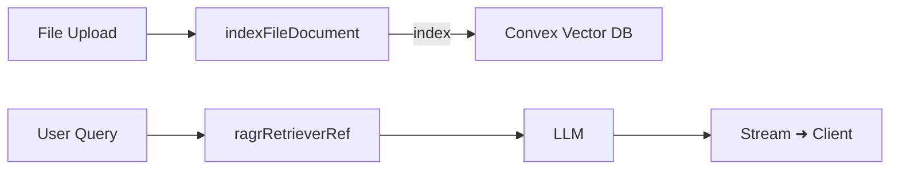

# Migration Plan: devLocalVectorstore ➜ Convex Vector DB

## 0 – Overview

Replace Genkit’s local filesystem vector store with **Convex Vector DB** via the `genkitx-convex` plugin while preserving the logical index name `documentRagStore` and session-scoped filtering.

---

## 1 – Preparation

1. **Install dependencies**

   ```bash
   pnpm add genkitx-convex convex
   pnpm dlx convex dev   # optional – local DB
   ```

2. **Create a Convex project**

   ```bash
   npx convex init
   ```

3. **Generate admin key** (Convex Dashboard → Settings → Keys)  
   Add to `.env`:

   ```env
   CONVEX_URL=https://<project-id>.convex.cloud
   CONVEX_ADMIN_KEY=<secret>
   ```

4. **Define vector schema** (`convex/schema.ts`)

   ```ts
   import { defineSchema, v } from "convex/server";
   export default defineSchema({
     documentRagStore: {
       vector: v.vector(1536),          // Gemini embedding size
       metadata: {
         documentId: v.string(),
         sessionId: v.string(),
         chunkId: v.string(),
         originalFileName: v.string(),
         pageNumber: v.number(),
         timestamp: v.string(),
       },
     },
   });
   ```

---

## 2 – Genkit Server Refactor

1. **Register plugin** – replace dev-local block in `src/genkit-server.ts`

   ```ts
   import {
     convexVectorstore,
     convexIndexerRef,
     convexRetrieverRef,
   } from "genkitx-convex";

   plugins.push(
     convexVectorstore({
       url: process.env.CONVEX_URL!,
       adminKey: process.env.CONVEX_ADMIN_KEY!,
       indexes: [
         {
           indexName: "documentRagStore",
           embedder: vertexAI.embedder("text-embedding-005"),
           schemaName: "documentRagStore",
         },
       ],
     }),
   );
   ```

2. **Update refs**

   ```ts
   export const ragIndexerRef = convexIndexerRef("documentRagStore");
   export const ragRetrieverRef = convexRetrieverRef("documentRagStore");
   ```

---

## 3 – Ingestion (`indexFileDocument`)

Metadata already matches the Convex schema – only change the `ragIndexerRef` import. No other logic modifications needed.

---

## 4 – Retrieval Flow (`documentQaStreamFlow`)

`where: { sessionId }` filter is supported by Convex retriever. Swap to the new `ragRetrieverRef`; flow logic stays intact.

---

## 5 – Data Migration (optional)

Run once if historical chunks are valuable:

```ts
// pseudo-script
for (const chunk of loadDevLocalChunks()) {
  convex.insert("documentRagStore", { ...chunk });
}
```

Otherwise, let users re-upload and re-index.

---

## 6 – Environment & Auth

|            | Dev (`convex dev`)      | Prod (Cloud)            |
|------------|-------------------------|-------------------------|
| URL        | <http://localhost:6789>   | `CONVEX_URL`           |
| Key        | none / dev key          | `CONVEX_ADMIN_KEY`     |
| Deploy     | hot-reload              | `convex deploy` via CI |

Admin key is used **only** on the server; never exposed to clients.

---

## 7 – Testing & Validation

1. **Unit** – mock Convex client; assert `aiInstance.index` called with docs.  
2. **Integration** – start `convex dev`, upload fixture, call RAG flow, expect ≥1 citation.  
3. **Load** – bulk insert 10 k chunks; verify P95 retrieval < 200 ms.

---

## 8 – Cleanup

* `pnpm remove @genkit-ai/dev-local-vectorstore`
* Delete obsolete `.genkit/vectorstore/**` directories.

---

## 9 – Mermaid Diagram



---
*End of plan*
